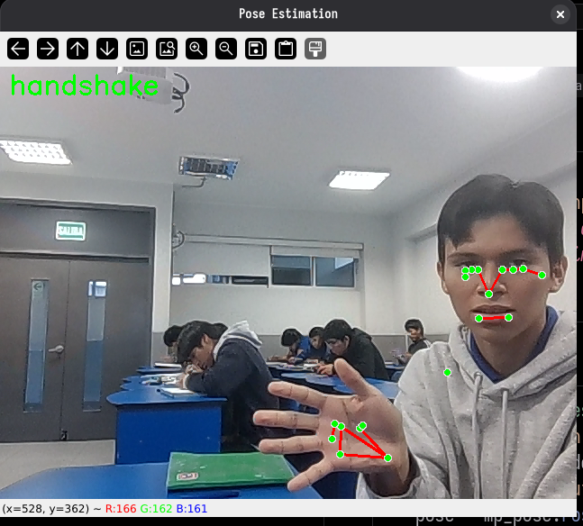
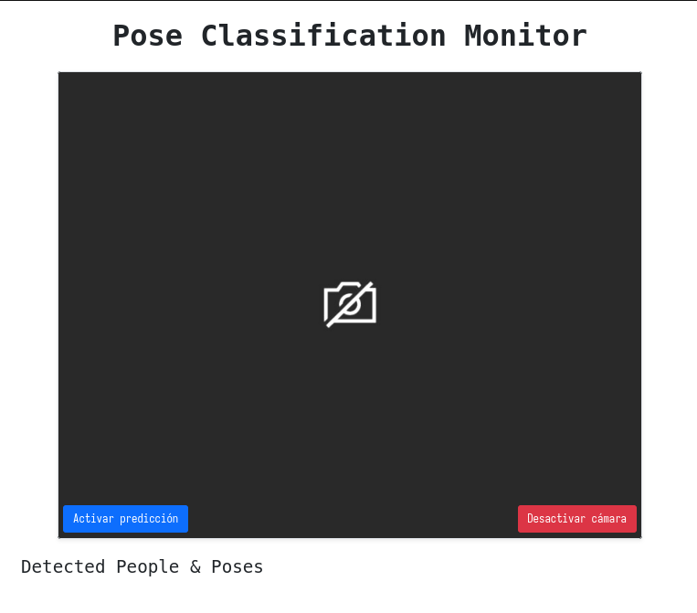
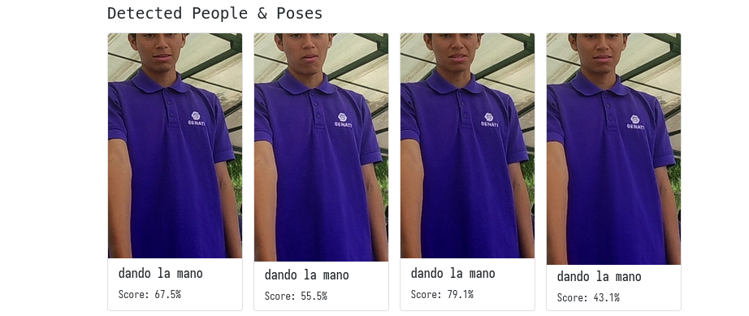

# Monitoreo de actividades con Inteligencia Artificial

Este proyecto implementa un sistema de clasificación y monitoreo de poses en tiempo real utilizando Inteligencia Artificial.

## Tecnologías

- **Node.js**: Servidor web.
- **TensorFlow.js**: Ejecución del modelo en el navegador.
- **MediaPipe**: Detección de landmarks de poses.
- **Bootstrap**: Diseño de interfaz.

## Capturas de Pantalla

### Detección con OpenCV

### Vista de Cámara

### Galería de Poses

